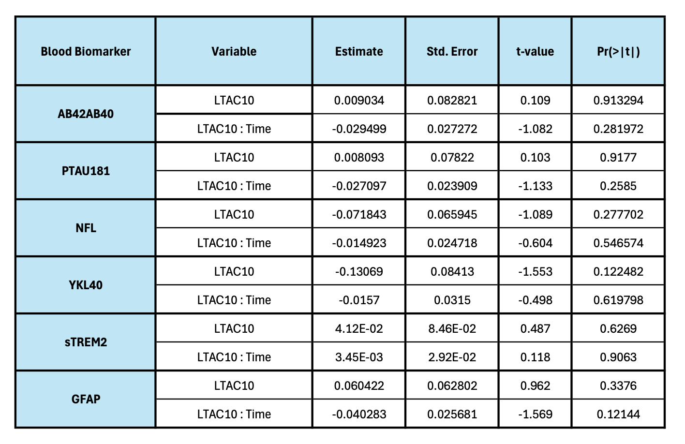

```{r setup, include=FALSE}
knitr::opts_chunk$set(message = FALSE, warning = FALSE, comment = NA,
                      fig.align = "center")
library(readxl)
library(tidyverse)
library(mice)
library(knitr)
library(here)
library(kableExtra)
library(ggplot2)
library(cowplot)
library(lmerTest) # mixed linear model
```

# Descriptive Statistics

```{r descriptive analysis}
data_act_clean <- read.csv(here("processed-data/Actigraphy_clean_data.csv"), 
                           row.names = 1, check.names = FALSE)
data_champs_clean <- read.csv(here("processed-data/CHAMPS_clean_data.csv"), 
                              row.names = 1, check.names = FALSE)
raw_vital <- read_excel(here("data/BIOCARD_Vital_Signs_Sensory_2023.04.17_Deidentified.xlsx"), sheet = "BIOCARD_VITAL_SIGNS_SENSORY")

# only contain baseline info for each patient
# calculate follow up time
data_act_clean_bl <- data_act_clean %>%
  group_by(SUBJECT_ID) %>%
  mutate(follow_up_time = max(AgeAtVisit) - Age_Act) %>%
  fill(follow_up_time, .direction = "downup") %>%
  mutate(n_ntk = n()) %>%
  slice_head(n = 1) %>%
  ungroup()

data_champs_clean_bl <- data_champs_clean %>%
  group_by(SUBJECT_ID) %>%
  mutate(follow_up_time = max(AgeAtVisit) - Age_CHAMPS) %>%
  fill(follow_up_time, .direction = "downup") %>%
  mutate(n_ntk = n()) %>%
  slice_head(n = 1) %>%
  ungroup()

# add champs data to actigraphy data on a patient level
data_act_clean_champs <- data_act_clean_bl %>%
  select(c(SUBJECT_ID, Age_Act)) %>%
  left_join(select(data_champs_clean_bl, SUBJECT_ID, Age_CHAMPS), by = "SUBJECT_ID") %>%
  mutate(Age_diff = Age_CHAMPS-Age_Act)

summary_stats <- data.frame(
  # Total number of participants
  N = nrow(data_act_clean_bl),

  # Number with a diagnosis of MCI or dementia at last visit
  N_with_MCI_dementia = sum(data_act_clean_bl$fup_Dx == 1, na.rm = TRUE),
  
  # Number of participants with 'Subject_ID' ≥ 400
  N_participants_400 = sum(data_act_clean_bl$SUBJECT_ID >= 400, na.rm = TRUE),
  
  # Mean (SD) Age_Act
  Mean_Age_Act = sprintf("%.2f (%.2f)", mean(data_act_clean_bl$Age_Act, na.rm = TRUE), sd(data_act_clean_bl$Age_Act, na.rm = TRUE)),
  
  # Range of Age_Act
  Range_Age_Act = sprintf("(%.2f, %.2f)", min(data_act_clean_bl$Age_Act, na.rm = TRUE), max(data_act_clean_bl$Age_Act, na.rm = TRUE)),
  
  # N (%) female sex
  N_female = sum(data_act_clean_bl$Sex_F == 1, na.rm = TRUE),
  Percent_female = sprintf("%.2f%%", (sum(data_act_clean_bl$Sex_F == 1, na.rm = TRUE) / nrow(data_act_clean_bl)) * 100),
  
  # Mean (SD) years of education
  Mean_EDUC = sprintf("%.2f (%.2f)", mean(data_act_clean_bl$EDUC, na.rm = TRUE), sd(data_act_clean_bl$EDUC, na.rm = TRUE)),
  
  # N (%) White race
  N_white = sum(data_act_clean_bl$Race_White == 1, na.rm = TRUE),
  Percent_white = sprintf("%.2f%%", (sum(data_act_clean_bl$Race_White == 1, na.rm = TRUE) / nrow(data_act_clean_bl)) * 100),
  
  # N (%) APOE4 carriers
  N_APOE4 = sum(data_act_clean_bl$APOE4 == 1, na.rm = TRUE),
  Percent_APOE4 = sprintf("%.2f%%", (sum(data_act_clean_bl$APOE4 == 1, na.rm = TRUE) / nrow(data_act_clean_bl)) * 100),
  
  # Mean (SD) years of Age_CHAMPS - Age_Act
  Mean_Age_Diff = sprintf("%.2f (%.2f)", mean(data_act_clean_champs$Age_diff, na.rm = TRUE), sd(data_act_clean_champs$Age_diff, na.rm = TRUE)),
  
  # Range of years of Age_CHAMPS - Age_Act
  Range_Age_Diff = sprintf("(%.2f, %.2f)", min(data_act_clean_champs$Age_diff, na.rm = TRUE), max(data_act_clean_champs$Age_diff, na.rm = TRUE)),
  
  # Mean (SD) years of follow-up
  Mean_Followup = sprintf("%.2f (%.2f)", mean(data_act_clean_bl$follow_up_time, na.rm = TRUE), sd(data_act_clean_bl$follow_up_time, na.rm = TRUE)),
  
  # Range of years of follow-up
  Range_Followup = sprintf("(%.2f, %.2f)", min(data_act_clean_bl$follow_up_time, na.rm = TRUE), max(data_act_clean_bl$follow_up_time, na.rm = TRUE)),
  
  # Mean (SD) number of blood biomarker measures
  Mean_Biomarkers = sprintf("%.2f (%.2f)", mean(data_act_clean_bl$n_ntk, na.rm = TRUE), sd(data_act_clean_bl$n_ntk, na.rm = TRUE)),
  
  # Range of number of blood biomarker measures
  Range_Biomarkers = sprintf("(%.2f, %.2f)", min(data_act_clean_bl$n_ntk, na.rm = TRUE), max(data_act_clean_bl$n_ntk, na.rm = TRUE)),
  
  # Mean (SD) time (in years) 
  Mean_Time = sprintf("%.2f (%.2f)", mean(data_act_clean_bl$Age_NTK_bl - data_act_clean_bl$Age_Act, na.rm = TRUE), sd(data_act_clean_bl$Age_NTK_bl - data_act_clean_bl$Age_Act, na.rm = TRUE)),
  
  # Mean Range (min, max) time (in years) 
  Range_Time = sprintf("(%.2f, %.2f)", min(data_act_clean_bl$Age_NTK_bl - data_act_clean_bl$Age_Act, na.rm = TRUE), max(data_act_clean_bl$Age_NTK_bl - data_act_clean_bl$Age_Act, na.rm = TRUE)),
  
  # Mean (SD) LTAC
  Mean_LTAC = sprintf("%.2f (%.2f)", mean(data_act_clean_bl$LTAC10, na.rm = TRUE), sd(data_act_clean_bl$LTAC10, na.rm = TRUE)),
  
  # Mean (SD) BMI
  Mean_BMI = sprintf("%.2f (%.2f)", mean(data_act_clean_bl$BMI, na.rm = TRUE), sd(data_act_clean_bl$BMI, na.rm = TRUE)),
  
  # Mean (SD) GFAP at baseline CHAMPS
  Mean_GFAP = sprintf("%.2f (%.2f)", mean(data_act_clean_bl[data_act_clean_bl$GFAP_outlier==0,]$GFAP, na.rm = TRUE), sd(data_act_clean_bl[data_act_clean_bl$GFAP_outlier==0,]$GFAP, na.rm = TRUE)),
  
  # Mean (SD) NFL at baseline CHAMPS
  Mean_NFL = sprintf("%.2f (%.2f)", 
      mean(data_act_clean_bl[data_act_clean_bl$NFL_outlier==0,]$NFL, na.rm = TRUE),
      sd(data_act_clean_bl[data_act_clean_bl$NFL_outlier==0,]$NFL, na.rm = TRUE)),
  
  # Mean (SD) PTAU181 at baseline CHAMPS
  Mean_PTAU181 = sprintf("%.2f (%.2f)", mean(data_act_clean_bl[data_act_clean_bl$PTAU181_outlier==0,]$PTAU181, na.rm = TRUE), sd(data_act_clean_bl[data_act_clean_bl$PTAU181_outlier==0,]$PTAU181, na.rm = TRUE)),
  
  # Mean (SD) AB42AB40 at baseline CHAMPS
  Mean_AB42AB40 = sprintf("%.2f (%.2f)", mean(data_act_clean_bl[data_act_clean_bl$AB42AB40_outlier==0,]$AB42AB40, na.rm = TRUE), sd(data_act_clean_bl[data_act_clean_bl$AB42AB40_outlier==0,]$AB42AB40, na.rm = TRUE)),
  
  # Mean (SD) PTAU181_AB42AB40 at baseline CHAMPS
  Mean_PTAU181_AB42AB40 = sprintf("%.2f (%.2f)", mean(data_act_clean_bl[data_act_clean_bl$AB42AB40_outlier==0 & data_act_clean_bl$PTAU181_outlier==0,]$PTAU181_AB42AB40, na.rm = TRUE), sd(data_act_clean_bl[data_act_clean_bl$AB42AB40_outlier==0 & data_act_clean_bl$PTAU181_outlier==0,]$PTAU181_AB42AB40, na.rm = TRUE)),
  
  # Mean (SD) sTREM2 at baseline CHAMPS
  Mean_sTREM2 = sprintf("%.2f (%.2f)", mean(data_act_clean_bl[data_act_clean_bl$sTREM2_outlier==0,]$sTREM2, na.rm = TRUE), sd(data_act_clean_bl[data_act_clean_bl$sTREM2_outlier==0,]$sTREM2, na.rm = TRUE)),
  
  # Mean (SD) YKL40 at baseline CHAMPS
  Mean_YKL40 = sprintf("%.2f (%.2f)", mean(data_act_clean_bl[data_act_clean_bl$YKL40_outlier==0,]$YKL40, na.rm = TRUE), sd(data_act_clean_bl[data_act_clean_bl$YKL40_outlier==0,]$YKL40, na.rm = TRUE))
)
```

```{r print out, echo=FALSE}
summary_stats <- as.data.frame(t(summary_stats))
summary_stats$Variable = c("N", 
                           "N with a diagnosis of MCI or dementia at last visit (‘fup_Dx’ = 1)",
                           "N participants with ‘Subject_ID’ ≥ 400 *",
                           "Mean (SD) Age_Act", "Range (min, max) Age_Act", 
                           "N female sex (‘Sex_F’ = 1)", 
                           "% female sex (‘Sex_F’ = 1)", 
                           "Mean (SD) years of education (‘EDUC’) ",
                           "N White race (‘Race_White’ = 1)", 
                           "% White race (‘Race_White’ = 1)", 
                           "N APOE4 carriers (‘APOE4’ = 1)",
                           "% APOE4 carriers (‘APOE4’ = 1)",
                           "Mean (SD) years between Age_CHAMPS and Age_Act", 
                           "Range (min, max) years between Age_CHAMPS and Age_Act", 
                           "Mean (SD) years of follow-up (baseline actigraphy to last blood biomarker measure)",
                           "Range (min, max) years of follow-up (baseline actigraphy to last blood biomarker measure)", 
                           "Mean (SD) number of blood biomarker measures over time", 
                           "Range (min, max) number of blood biomarker measures over time",
                           "Mean (SD) time (in years) between baseline actigraphy and associated baseline blood biomarker measure",
                           "Range (min, max) time (in years) between baseline actigraphy and associated baseline blood biomarker measure", 
                           "Mean (SD) LTAC10", 
                           "Mean (SD) BMI", 
                           "Mean (SD) GFAP at baseline actigraphy", 
                           "Mean (SD) NFL at baseline actigraphy", 
                           "Mean (SD) PTAU181 at baseline actigraphy", 
                           "Mean (SD) AB42AB40 at baseline actigraphy", 
                           "Mean (SD) PTAU181_AB42AB40 at baseline actigraphy", 
                           "Mean (SD) sTREM2 at baseline actigraphy", 
                           "Mean (SD) YKL40 at baseline actigraphy"
)
colnames(summary_stats) = c("Participants in analyses", "")

summary_stats %>%
  kable(caption = "Descriptive Statistics for Participants Included in the Actigraphy Analyses")
```

# Model Analysis

### Model Specification

The linear mixed-effects model used in this analysis is specified as follows:

$$
Y_{ij} = \beta_0 + \beta_1 \text{time}_{ij} + \beta_2 \text{Age_Act}_i + \beta_3 \text{Sex_F}_i + \beta_4 \text{APOE4}_i + \beta_5 \text{BMI}_i + \beta_6 \text{Act}_i
+ \\ \beta_7 (\text{time}_{ij} \times \text{Age_Act}_i) + \beta_8 (\text{time}_{ij} \times \text{Sex_F}_i) + \beta_9 (\text{time}_{ij} \times \text{APOE4}_i) + \beta_{10} (\text{time}_{ij} \times \text{BMI}_i) + \beta_{11} (\text{time}_{ij} \times \text{Act}_i) \\
+ u_{0i} + u_{1i} \text{time}_{ij} + \epsilon_{ij}
$$

Where:

-   $Y_{ij}$ is the biomarker outcome for participant $i$ at time $j$.
-   $\beta_0$ is the fixed intercept.
-   $\beta_1, \dots, \beta_{11}$ are the fixed effect coefficients.
-   $u_{0i} \sim N(0, \sigma^2_u)$ is the random intercept for subject $i$.
-   $u_{1i} \sim N(0, \sigma^2_v)$ is the random slope for time for subject $i$.
-   $\epsilon_{ij} \sim N(0, \sigma^2)$ is the residual error.

### Data Preparation

```{r model analysis act data prep}
data_act_clean_analysis <- data_act_clean |>
  mutate(time = AgeAtVisit - Age_Act, 
         VISITNO = as.numeric(VISITNO),
         LTAC10_z = (LTAC10 - mean(LTAC10, na.rm = TRUE)) / sd(LTAC10, na.rm = TRUE),
         Age_Act_z = (Age_Act - mean(Age_Act, na.rm = TRUE)) / sd(Age_Act, na.rm = TRUE)) |>
  left_join(raw_vital[,c("SUBJECT_ID","VISITNO","BMISR")], by = c("SUBJECT_ID", "VISITNO")) |>
  mutate(BMI = coalesce(BMI, BMISR),
         BMI_z = (BMI - mean(BMI, na.rm = TRUE)) / sd(BMI, na.rm = TRUE)) |>
  filter(!if_all(ends_with("_zscore"), is.na)) |>
  group_by(SUBJECT_ID) %>%
  mutate(bl_sex = ifelse(first_act_visit == 1, Sex_F, NA),
         bl_APOE4 = ifelse(first_act_visit == 1, APOE4, NA),
         bl_BMI_z = ifelse(first_act_visit == 1, BMI_z, NA),
         bl_LTAC10_z = ifelse(first_act_visit == 1, LTAC10_z, NA)) |>
  fill(bl_sex, .direction = "down") |>
  fill(bl_BMI_z, .direction = "down") |>
  fill(bl_LTAC10_z, .direction = "down") |>
  fill(bl_APOE4, .direction = "down") |>
  ungroup() |>
  select(SUBJECT_ID, VISITNO, DIAGNOSIS, bl_LTAC10_z, Age_Act, AgeAtVisit, Age_Act_z,
         bl_sex, bl_APOE4, bl_BMI_z, time, PTAU181_zscore, AB42AB40_zscore, 
         NFL_zscore, YKL40_zscore, sTREM2_zscore, GFAP_zscore)
```

```{r save processed act data, echo=FALSE}
write.csv(data_act_clean_analysis, here("processed-data/Actigraphy_clean_data.csv"))
```

### Data Visualizations

Z score by sex for blood biomarkers

```{r blood biomarker by sex}
summary <- data_act_clean_analysis |>
    group_by(bl_sex) |>
    select(ends_with("_z")) |>
    pivot_longer(-bl_sex, names_to = "Biomarker", values_to = "Value")

ggplot(summary, aes(x = Biomarker, y = Value, fill = as.factor(bl_sex))) +
    geom_boxplot(alpha = 0.7) +
    scale_fill_manual(values = c("0" = "#1f78b4", "1" = "#e31a1c"),
                      labels = c("Male", "Female")) +
    scale_x_discrete(labels = c(
        "Age_Act_z" = "Baseline Age",
        "bl_BMI_z" = "Body Mass Index",
        "bl_LTAC10_z" = "LTAC10"
    )) +
    labs(title = "Distribution of Z-scored Continuous Predictors by Sex",
         x = "Predictors",
         y = "Z-score Value",
         fill = "Sex") +
    theme_minimal() +
    theme(title = element_text(face = "bold", size = 11))
```

```{r predictors plot}
summary <- data_act_clean_analysis |>
    group_by(bl_sex) |>
    select(ends_with("_zscore")) |>
    pivot_longer(-bl_sex, names_to = "Biomarker", values_to = "Value")

ggplot(summary, aes(x = Biomarker, y = Value, fill = as.factor(bl_sex))) +
    geom_boxplot(alpha = 0.7) +
    scale_fill_manual(values = c("0" = "#1f78b4", "1" = "#e31a1c"),
                      labels = c("Male", "Female")) +
    scale_x_discrete(labels = c(
        "PTAU181_zscore" = "PTAU181",
        "AB42AB40_zscore" = "AB42AB40",
        "NFL_zscore" = "NFL",
        "YKL40_zscore" = "YKL40",
        "sTREM2_zscore" = "sTREM2",
        "GFAP_zscore" = "GFAP"
    )) +
    labs(title = "Distribution of Z-scored Blood Biomarkers by Sex",
         x = "Biomarker",
         y = "Z-score Value",
         fill = "Sex") +
    theme_minimal() +
    theme(title = element_text(face = "bold", size = 14))
```

### AB42AB40

```{r AB42AB40}
AB42AB40_act_data <- data_act_clean_analysis |>
  select(-c(PTAU181_zscore, NFL_zscore, YKL40_zscore, sTREM2_zscore, GFAP_zscore)) |>
  filter(!is.na(AB42AB40_zscore))

AB42AB40_act_model <- lmer(AB42AB40_zscore ~ 
    time*(bl_LTAC10_z + Age_Act_z + bl_sex + bl_APOE4 + bl_BMI_z) + (1 + time | SUBJECT_ID),
    data = AB42AB40_act_data, 
    control = lmerControl(optimizer = "bobyqa"))

summary(AB42AB40_act_model)
```

### PTAU181

```{r PTAU181}
PTAU181_act_data <- data_act_clean_analysis |>
  select(-c(AB42AB40_zscore, YKL40_zscore, NFL_zscore, sTREM2_zscore, GFAP_zscore)) |>
  filter(!is.na(PTAU181_zscore))

PTAU181_act_model <- lmer(PTAU181_zscore ~ 
    time*(bl_LTAC10_z + Age_Act_z + bl_sex + bl_APOE4 + bl_BMI_z) + (1 + time | SUBJECT_ID),
    data = PTAU181_act_data, 
    control = lmerControl(optimizer = "bobyqa"))

summary(PTAU181_act_model)
```

### NFL

```{r NFL}
NFL_act_data <- data_act_clean_analysis |>
  select(-c(PTAU181_zscore, AB42AB40_zscore, YKL40_zscore, sTREM2_zscore, GFAP_zscore)) |>
  filter(!is.na(NFL_zscore))

NFL_act_model <- lmer(NFL_zscore ~ 
    time*(bl_LTAC10_z + Age_Act_z + bl_sex + bl_APOE4 + bl_BMI_z) + (1 + time | SUBJECT_ID),
    data = NFL_act_data, 
    control = lmerControl(optimizer = "bobyqa"))

summary(NFL_act_model)
```

### YKL40

```{r YKL40}
YKL40_act_data <- data_act_clean_analysis |>
  select(-c(PTAU181_zscore, AB42AB40_zscore, NFL_zscore, sTREM2_zscore, GFAP_zscore)) |>
  filter(!is.na(YKL40_zscore))

YKL40_act_model <- lmer(YKL40_zscore ~ 
    time*(bl_LTAC10_z + Age_Act_z + bl_sex + bl_APOE4 + bl_BMI_z) + (1 + time | SUBJECT_ID),
    data = YKL40_act_data, 
    control = lmerControl(optimizer = "bobyqa"))

summary(YKL40_act_model)
```

### sTREM2

```{r sTREM2}
sTREM2_act_data <- data_act_clean_analysis |>
  select(-c(PTAU181_zscore, AB42AB40_zscore, YKL40_zscore, NFL_zscore, GFAP_zscore)) |>
  filter(!is.na(sTREM2_zscore))

sTREM2_act_model <- lmer(sTREM2_zscore ~ 
    time*(bl_LTAC10_z + Age_Act_z + bl_sex + bl_APOE4 + bl_BMI_z) + (1 + time | SUBJECT_ID),
    data = sTREM2_act_data, 
    control = lmerControl(optimizer = "bobyqa"))

summary(sTREM2_act_model)
```

### GFAP

```{r GFAP}
GFAP_act_data <- data_act_clean_analysis |>
  select(-c(PTAU181_zscore, AB42AB40_zscore, YKL40_zscore, NFL_zscore, sTREM2_zscore)) |>
  filter(!is.na(GFAP_zscore))

GFAP_act_model <- lmer(GFAP_zscore ~ 
    time*(bl_LTAC10_z + Age_Act_z + bl_sex + bl_APOE4 + bl_BMI_z) + (1 + time | SUBJECT_ID),
    data = GFAP_act_data, 
    control = lmerControl(optimizer = "bobyqa"))

summary(GFAP_act_model)
```

### Summary


